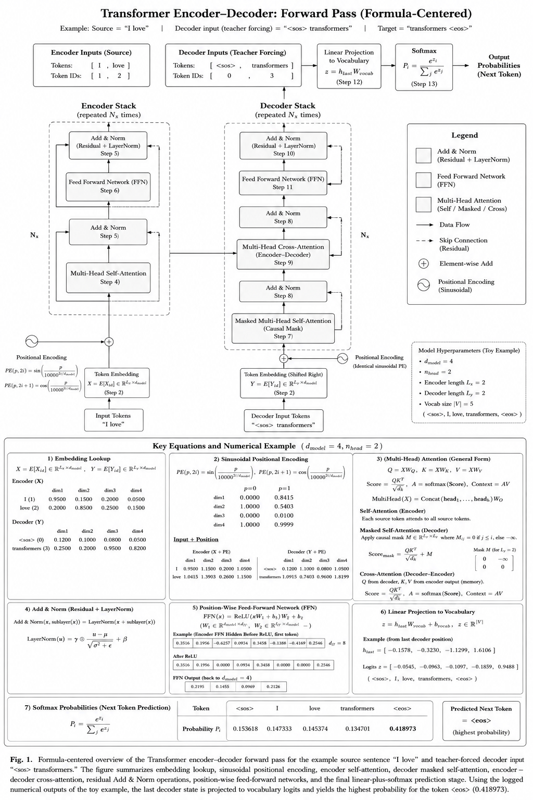
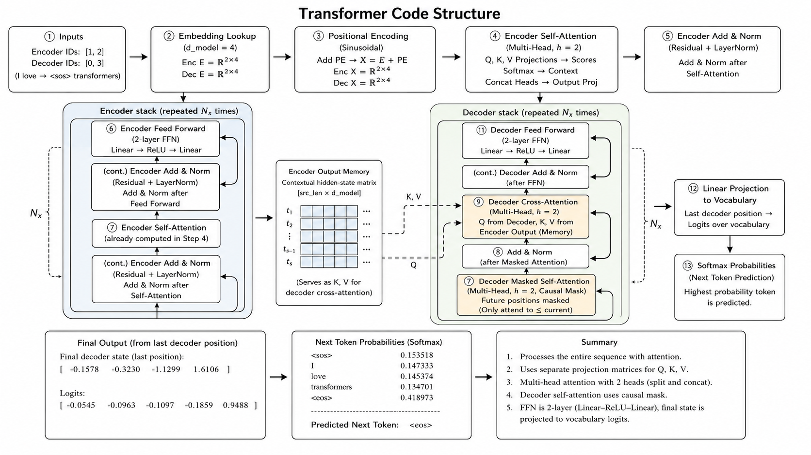

## Abstract

**A Formula-Centered Walkthrough of the Transformer Encoder–Decoder Forward Pass: Numerical Verification with a Toy Example**

I present a formula-centered, step-by-step exposition of the Transformer encoder-decoder forward pass, grounding each computational stage in explicit numerical values derived from a minimal toy example ($d_{model}=4$, $n_{head}=2$, vocabulary size $|V|=5$).

Starting from token-ID lookup and sinusoidal positional encoding, we trace the propagation of representations through encoder multi-head self-attention, position-wise feed-forward networks, and residual Add & Norm operations, before detailing decoder masked self-attention, encoder-decoder cross-attention, and the final linear projection to vocabulary logits.

For each sub-operation, including scaled dot-product attention ($\mathrm{Score}=QK^T/\sqrt{d_k}$), causal masking ($M_{ij}=-\infty$ for $j>i$), layer normalization, and ReLU-gated FFN, we report the corresponding intermediate matrices computed from the running example.

The forward pass concludes with a softmax over five candidate tokens, yielding $P(\langle eos \rangle)=0.4190$ as the highest-probability next token, which is consistent with the teacher-forced target sequence.

This work is intended as a pedagogical reference for researchers and practitioners seeking a transparent, formula-level understanding of Transformer inference, and serves as a reproducible baseline for debugging and validating custom implementations.



# Transformer Encoder–Decoder Forward Pass Educational Implementation

A pedagogical C++ implementation of the Transformer Encoder–Decoder forward propagation pipeline, designed for structural interpretability rather than production-scale training.
The project explicitly computes each intermediate tensor involved in the Transformer architecture, including token embedding lookup, sinusoidal positional encoding, multi-head attention, residual connections, layer normalization, feed-forward networks, and final vocabulary projection. 

## Transformer Code Architecture


---

## Overview

This repository provides a minimal and mathematically transparent implementation of the original Transformer forward pass architecture introduced in:

> Attention Is All You Need

The implementation is intentionally constructed with:

* Explicit tensor operations
* Deterministic toy weights
* Full intermediate state printing
* Small dimensionality (`d_model = 4`)
* No external deep learning framework dependencies

The objective is not high-performance inference, but rather to expose the internal computational mechanics of Transformer architectures at a level suitable for:

* graduate coursework,
* architecture analysis,
* educational demonstrations,
* debugging attention behavior,
* understanding encoder-decoder interaction,
* studying attention mathematics before framework abstraction.

---

# Architectural Scope

The implementation contains the complete forward propagation pipeline for a classical Transformer Encoder–Decoder model:

```text
Input Tokens
    ↓
Embedding Lookup
    ↓
Positional Encoding
    ↓
Encoder Self-Attention
    ↓
Encoder Add & LayerNorm
    ↓
Encoder Feed Forward Network
    ↓
Decoder Masked Self-Attention
    ↓
Decoder Add & LayerNorm
    ↓
Decoder Cross-Attention
    ↓
Decoder Add & LayerNorm
    ↓
Decoder Feed Forward Network
    ↓
Linear Vocabulary Projection
    ↓
Softmax Probability Distribution
    ↓
Next Token Prediction
```

The example sequence used in the implementation is:

```text
Encoder Input : "I love"
Decoder Input : "<sos> transformers"
Prediction Target : "<eos>"
```

---

# Project Characteristics

## 1. Educational Tensor Transparency

Unlike framework-based implementations where operations are hidden behind CUDA kernels or graph execution engines, every matrix operation is explicitly implemented:

* matrix multiplication,
* transposition,
* softmax,
* dot product,
* residual addition,
* layer normalization,
* causal masking,
* attention score computation.

This allows direct verification of:

```text
QK^T / sqrt(d_k)
softmax(score)
Attention(Q,K,V)
```

without relying on opaque backend abstractions.

---

## 2. Deterministic Toy Parameters

The project intentionally avoids random initialization and training procedures.

All embeddings and weight matrices are manually defined toy parameters chosen to:

* stabilize numerical output,
* preserve interpretability,
* prevent exploding activations,
* produce human-readable attention behavior,
* generate reproducible outputs.

The weights are therefore not learned model parameters.

They are controlled educational coefficients intended solely to demonstrate architectural flow. 

---

## 3. Full Encoder–Decoder Separation

The implementation preserves the canonical distinction between:

* Encoder Self-Attention
* Decoder Masked Self-Attention
* Decoder Cross-Attention

This is particularly important because many simplified educational examples collapse these mechanisms into a single attention block.

The project instead demonstrates:

```text
Encoder:
Q = XWQ
K = XWK
V = XWV
```

```text
Decoder Masked Attention:
Q = YWQ
K = YWK
V = YWV
```

```text
Cross Attention:
Q = Decoder State
K = Encoder Output
V = Encoder Output
```

which exposes how the decoder selectively references encoder memory during sequence generation.

---

# Mathematical Components

The implementation explicitly models the following Transformer equations.

## Token Embedding

```math
X = E[X_{id}]
```

## Positional Encoding

```math
\begin{aligned}
PE(pos, 2i) &= \sin\left(\frac{pos}{10000^{2i/d_{model}}}\right) \\
PE(pos, 2i + 1) &= \cos\left(\frac{pos}{10000^{2i/d_{model}}}\right)
\end{aligned}
```

---

## Scaled Dot-Product Attention

```math
\mathrm{Attention}(Q, K, V) = \mathrm{softmax}\left(\frac{QK^T}{\sqrt{d_k}}\right)V
```

---

## Feed Forward Network

```math
\mathrm{FFN}(x) = \mathrm{ReLU}(xW_1 + b_1)W_2 + b_2
```

---

## Layer Normalization

```math
LayerNorm(x)=\frac{x-\mu}{\sqrt{\sigma^2+\epsilon}}
```
---

# Multi-Head Attention Structure

The implementation uses:

```text
d_model = 4
num_heads = 2
d_head = 2
```

The attention heads are explicitly separated and concatenated:

```text
Head 0 : first 2 dimensions
Head 1 : last 2 dimensions
```

followed by output projection:

```text
Concat(head_0, head_1)W^O
```

Intermediate attention scores and probabilities are printed for every head.

---

# Decoder Causal Masking

The decoder self-attention block applies causal masking to prevent future token leakage.

The masking rule is:

```text
j > i → masked
```

implemented numerically using:

```text
-1e9
```

prior to softmax normalization.

This reproduces autoregressive decoding constraints used in GPT-style generation systems.

---

# Build Instructions

## Requirements

* C++17 or later
* Standard Template Library (STL)
* GCC / Clang / MSVC compatible

No external dependencies are required.

---

## Linux / macOS

```bash
./build.sh
./build/forward_example
```

Manual compile:

```bash
g++ -std=c++17 -Wall -Wextra -pedantic forward.cpp main.cpp -o forward_example
./forward_example
```

Additional examples:

```bash
./build.sh release
./build.sh asan run
```

---

## Windows (MSVC)

```bash
cl /EHsc /std:c++17 forward.cpp main.cpp /Fe:forward_example.exe
forward_example.exe
```

---

# Expected Output

The program prints all intermediate Transformer states, including:

* token IDs,
* embeddings,
* positional encodings,
* Q/K/V matrices,
* attention scores,
* attention probabilities,
* attention context vectors,
* FFN activations,
* layer normalization outputs,
* final vocabulary logits,
* softmax probabilities,
* predicted next token.

Example final prediction:

```text
Predicted token: <eos>
```

---

# Numerical Stability Considerations

Several implementation details intentionally follow numerically stable practices:

## Softmax Stabilization

Before exponentiation:

```math
x_i ← x_i - max(x)
```

to reduce overflow risk.

---

## LayerNorm Epsilon

```math
\epsilon = 1e-5
```

is added to variance normalization to prevent division-by-zero instability.

---

## Shape Validation

The implementation includes runtime dimension checks to detect:

* matrix shape mismatches,
* invalid token IDs,
* malformed tensor operations.

---

# Relation to Modern LLM Architectures

This implementation models the classical encoder-decoder Transformer topology.

Modern systems diverge as follows:

| Model Family      | Architecture    |
| ----------------- | --------------- |
| OpenAI GPT series | Decoder-only    |
| Google BERT       | Encoder-only    |
| Google T5         | Encoder–Decoder |
| Meta LLaMA        | Decoder-only    |

The current repository therefore represents the foundational Transformer formulation from which many modern architectures evolved.

---

# Related Documentation

A detailed mathematical derivation document accompanies this implementation:

* `transformer_forward_summary.pdf` 

The document expands the numerical derivations for:

* embedding lookup,
* positional encoding,
* attention score computation,
* softmax normalization,
* FFN transformations,
* final vocabulary projection.

---

# Limitations

This implementation intentionally omits:

* backpropagation,
* gradient descent,
* optimizer states,
* batching,
* GPU kernels,
* mixed precision,
* KV cache optimization,
* rotary positional embedding (RoPE),
* beam search,
* tokenizer implementation,
* training loop infrastructure.

The repository focuses exclusively on forward propagation interpretability.

---

# Suggested Extensions

Potential future expansions include:

1. Backpropagation implementation
2. Gradient visualization
3. Cross-entropy loss computation
4. Training loop integration
5. Weight update demonstration
6. Beam search decoding
7. Rotary positional embeddings
8. KV cache implementation
9. CUDA acceleration
10. LibTorch integration

---

# License

This project is intended primarily for educational and research purposes.
